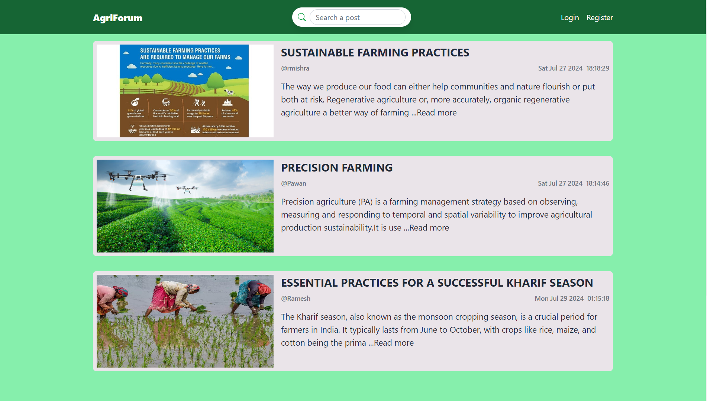
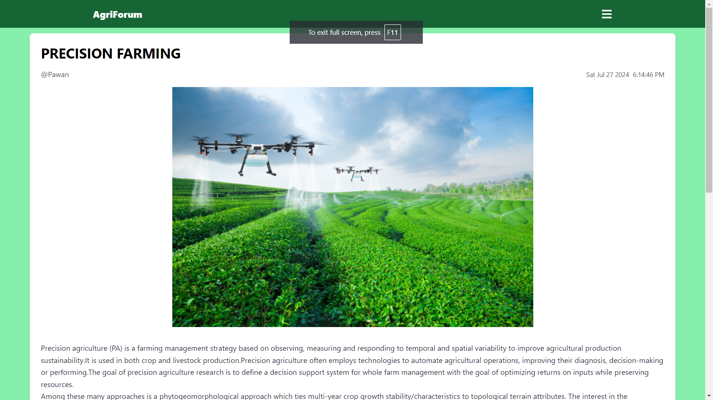
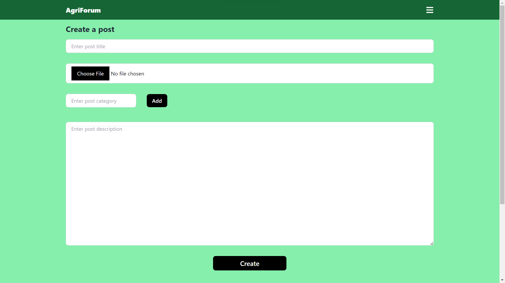
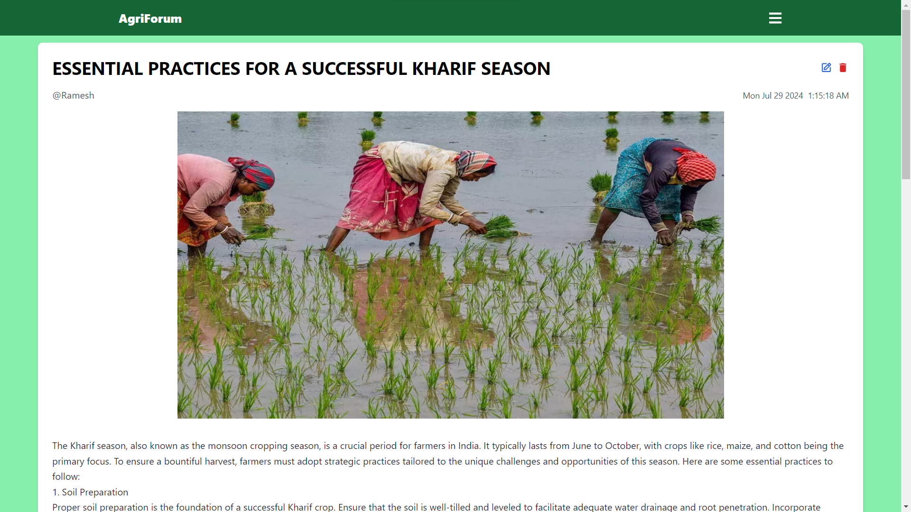
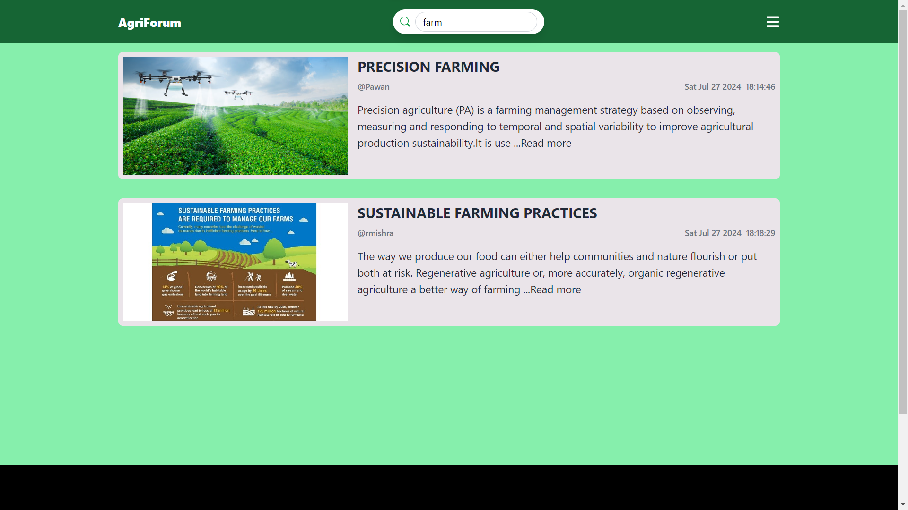

# AgriForum

AgriForum is a dedicated forum for farmers and agricultural experts to share insights and best practices, aimed at enhancing agricultural knowledge.

## Table of Contents

- [Features](#features)
- [Technologies Used](#technologies-used)
- [Screenshots](#screenshots)

## Features

- **User authentication and authorization**
- **Post creation, editing, and deletion**
- **Search functionality to search posts with specific keywords**
- **Responsive design using Tailwind CSS**

## Technologies Used

- **Frontend**: React.js, Tailwind CSS
- **Backend**: Node.js, Express.js
- **Database**: MongoDB
- **Image Storage**: Cloudinary

## Screenshots

### Homepage

### Post Detail

### Create Post

### Edit Post

### Search Functionality

